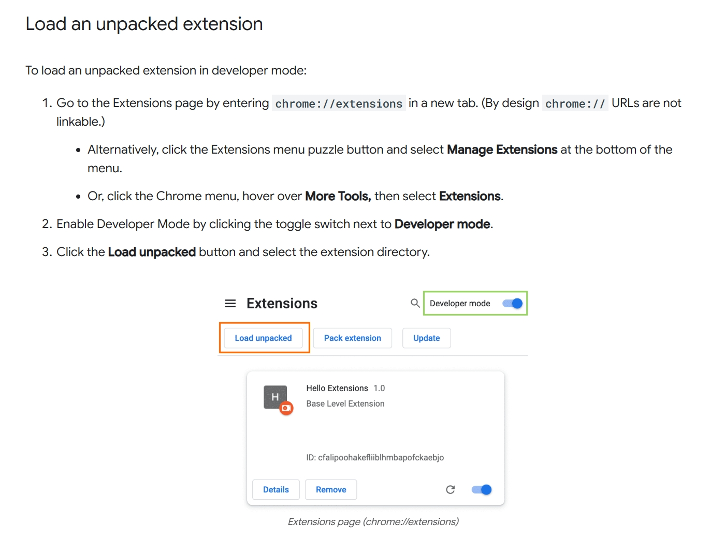

# 倍速插件
功能：  
-在原有b站倍速增加了2.5倍速和3倍速  
-自定义倍速 （除非刷新，否则可以持久化保存）参考以下
```javascript
const vobserver = new MutationObserver((mutations) => {
  if (mutations[0]) {
      video.playbackRate = rate  // 加载原有倍速
  }
})
vobserver.observe(video, {
    attributes: true,
    attributeFilter: ['src']
})
```
## 使用方法  
1.下载文件并解压  
2.打开浏览器扩展页面，打开开发者模式  
3.加载extension文件夹并启用  
### 参考  

### 其他说明  
整的第一个插件。可能有bug，出问题就使用刷新大法  

---

#### 优化（犯蠢）过程：  
-用setTimeout等待元素生成不够精准，改用监听全局元素  
-监听全局极影响性能，导致图片没法加载。改成监听主要组件app，再监听目标元素  
-归根结底，启用监听subtree就会影响性能，于是回归使用定时器  
-发现在页面创建自定义倍速盒子不需要等待元素生成，把那部分代码移到定时器外，结果又导致页面加载不全  
-隐约猜到如果代码任何一处有毛病，就会影响b站的图片加载等等，于是又把代码搬回定时器  
-才发现setTimeout的关键问题。改用setInterval  
-新增了番剧页面的倍速功能  
**总而言之：差点全部木大**

